Accident Locations
================
Group 4
April 23, 2020

\#What causes accidents in a specific location?

\#\#Setup

For the setup we loaded text files related directly to Michigan
Accidents as well as County data. Additionally, we loaded some of our
base packages. As the project went on, we went back and added any
additional packages that were needed to dig deeper into the data.

``` r
knitr::opts_chunk$set(echo = FALSE) 
```

    ## 
    ## Attaching package: 'dplyr'

    ## The following objects are masked from 'package:stats':
    ## 
    ##     filter, lag

    ## The following objects are masked from 'package:base':
    ## 
    ##     intersect, setdiff, setequal, union

    ## ── Attaching packages ──────────────────────────── tidyverse 1.3.0 ──

    ## ✓ tibble  2.1.3     ✓ stringr 1.4.0
    ## ✓ readr   1.3.1     ✓ forcats 0.5.0
    ## ✓ purrr   0.3.3

    ## ── Conflicts ─────────────────────────────── tidyverse_conflicts() ──
    ## x dplyr::filter() masks stats::filter()
    ## x dplyr::lag()    masks stats::lag()
    ## x purrr::map()    masks maps::map()

    ## 
    ## Attaching package: 'lubridate'

    ## The following object is masked from 'package:base':
    ## 
    ##     date

    ## Loading required package: RColorBrewer

\#Part 1 - Variables

For the first phase in looking at specific locations and causes, we took
a deep dive at some of our variables. As you can see below we took a
summary of all whether characteristics on as a whole (state of
Michigan.) By doing this we think we were able to see that although we
see extremes in whether, nothing specifically jumps out as happening out
of the ordinary during accidents. With this we were also able to note,
although a majority of accidents aren’t happening under specific
conditions, possibly the severity could be changed by
    this.

    ##     Severity     Distance.mi.     Temperature.F.   Wind_Chill.F.   
    ##  Min.   :1.00   Min.   : 0.0000   Min.   :-17.00   Min.   :-40.20  
    ##  1st Qu.:2.00   1st Qu.: 0.0000   1st Qu.: 33.10   1st Qu.: 16.20  
    ##  Median :2.00   Median : 0.0000   Median : 52.00   Median : 27.90  
    ##  Mean   :2.46   Mean   : 0.2118   Mean   : 50.79   Mean   : 31.14  
    ##  3rd Qu.:3.00   3rd Qu.: 0.0100   3rd Qu.: 70.00   3rd Qu.: 40.30  
    ##  Max.   :4.00   Max.   :65.5990   Max.   : 97.00   Max.   : 95.00  
    ##                                   NA's   :235      NA's   :41797   
    ##   Humidity...      Pressure.in.   Visibility.mi.   Wind_Speed.mph. 
    ##  Min.   : 12.00   Min.   :27.78   Min.   : 0.000   Min.   : 0.000  
    ##  1st Qu.: 56.00   1st Qu.:29.75   1st Qu.: 9.000   1st Qu.: 6.000  
    ##  Median : 73.00   Median :29.98   Median :10.000   Median : 9.200  
    ##  Mean   : 70.34   Mean   :29.89   Mean   : 8.544   Mean   : 9.735  
    ##  3rd Qu.: 86.00   3rd Qu.:30.14   3rd Qu.:10.000   3rd Qu.:12.700  
    ##  Max.   :100.00   Max.   :31.15   Max.   :12.000   Max.   :43.700  
    ##  NA's   :278      NA's   :212     NA's   :212      NA's   :6209    
    ##  Precipitation.in.
    ##  Min.   :0.00     
    ##  1st Qu.:0.00     
    ##  Median :0.00     
    ##  Mean   :0.02     
    ##  3rd Qu.:0.01     
    ##  Max.   :1.89     
    ##  NA's   :58199

In Congruence with the in-depth look at the weather, we decided to take
a look at the street indicators as variables. By doing this we were able
to provide a graph that jumped out to us. Traffic signals, Junctions and
Crossings have a significant amount of crashes compared to other traffic
indicators. This is helpful to keep in mind during our work.

    ## # A tibble: 48 x 14
    ## # Groups:   Amenity, Bump, Crossing, Give_Way, Junction, No_Exit, Railway,
    ## #   Roundabout, Station, Stop, Traffic_Calming, Traffic_Signal, Turning_Loop
    ## #   [48]
    ##    Amenity Bump  Crossing Give_Way Junction No_Exit Railway Roundabout Station
    ##    <fct>   <fct> <fct>    <fct>    <fct>    <fct>   <fct>   <fct>      <fct>  
    ##  1 False   False False    False    False    False   False   False      False  
    ##  2 False   False False    False    False    False   False   False      False  
    ##  3 False   False False    False    False    False   False   False      False  
    ##  4 False   False False    False    False    False   False   False      False  
    ##  5 False   False False    False    False    False   False   False      False  
    ##  6 False   False False    False    False    False   False   False      True   
    ##  7 False   False False    False    False    False   False   False      True   
    ##  8 False   False False    False    False    False   True    False      False  
    ##  9 False   False False    False    False    False   True    False      True   
    ## 10 False   False False    False    False    True    False   False      False  
    ## # … with 38 more rows, and 5 more variables: Stop <fct>, Traffic_Calming <fct>,
    ## #   Traffic_Signal <fct>, Turning_Loop <fct>, n <int>

    ##   Amenity         Bump        Crossing      Give_Way      Junction    
    ##  False:87928   False:88693   False:84817   False:88690   False:81067  
    ##  True :  766   True :    1   True : 3877   True :    4   True : 7627  
    ##   No_Exit       Railway      Roundabout     Station         Stop      
    ##  False:88594   False:88436   False:88693   False:88295   False:88519  
    ##  True :  100   True :  258   True :    1   True :  399   True :  175  
    ##  Traffic_Calming Traffic_Signal Turning_Loop 
    ##  False:88690     False:78716    False:88694  
    ##  True :    4     True : 9978

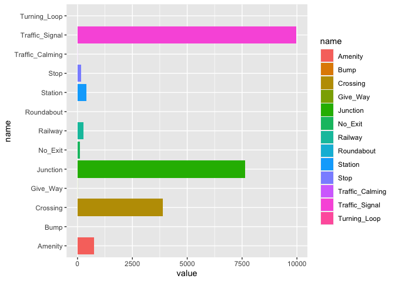<!-- -->

    ## Warning: Removed 235 rows containing non-finite values (stat_bin).

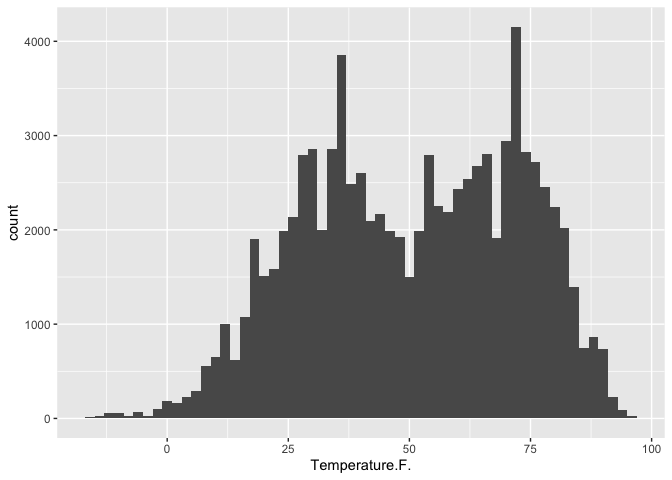<!-- -->

    ## `stat_bin()` using `bins = 30`. Pick better value with `binwidth`.

    ## Warning: Removed 41797 rows containing non-finite values (stat_bin).

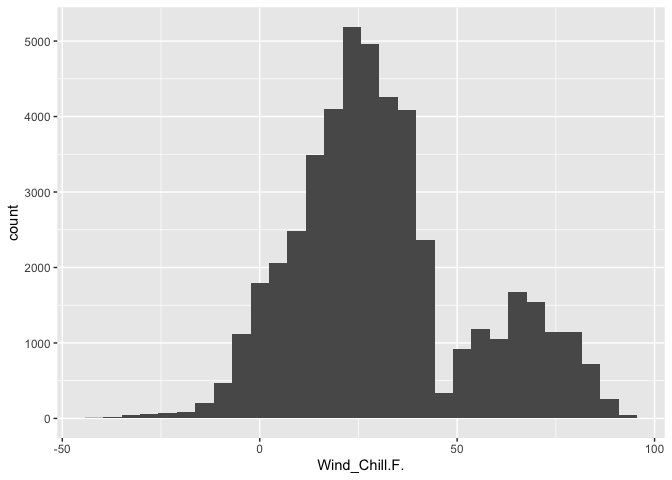<!-- -->

    ## `stat_bin()` using `bins = 30`. Pick better value with `binwidth`.

    ## Warning: Removed 6209 rows containing non-finite values (stat_bin).

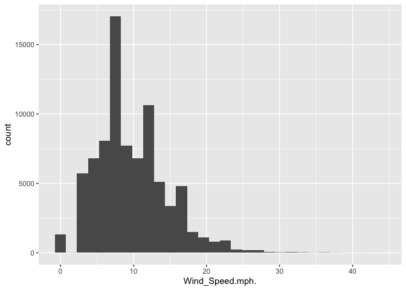<!-- -->

    ## `stat_bin()` using `bins = 30`. Pick better value with `binwidth`.

    ## Warning: Removed 278 rows containing non-finite values (stat_bin).

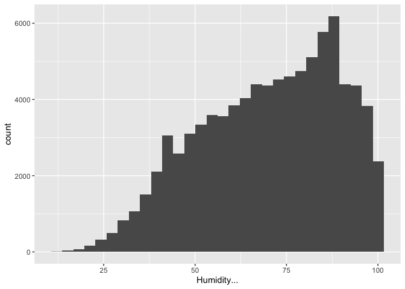<!-- -->

\#Phase 2 - Location

Now that we have taken a quick look at a majority of the variables in
our data, we were able to focus on location. You will see in multiple of
our worksheets that we focused in on Counties. Below we started off by
graphing the counts of accidents in certain counties. For specific
location we thought it would be a good idea to focus in on Counties with
the highest accidents. In a real-life scenario, this could be most
useful for safety issues and change. As you can see below Genesee, Wayne
and Kent county were our top three locations by count of accidents.

    ##      County         n           
    ##  Alcona : 1   Min.   :    1.00  
    ##  Alger  : 1   1st Qu.:   13.25  
    ##  Allegan: 1   Median :   27.00  
    ##  Alpena : 1   Mean   : 1081.63  
    ##  Antrim : 1   3rd Qu.:  202.75  
    ##  Arenac : 1   Max.   :27072.00  
    ##  (Other):76

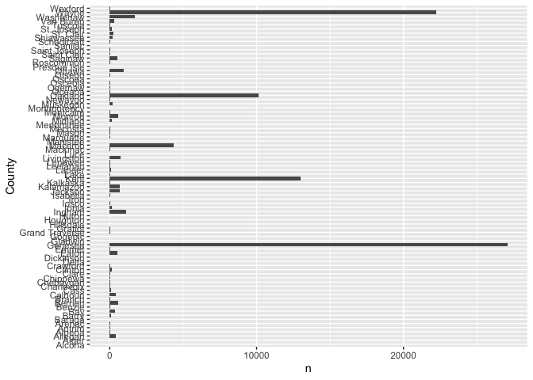<!-- -->

\#\#\#City

More specifically, we wanted to identify specific locations. So we
created a dataset specifically with Cities in Genesee County. By doing
this we were able to then count the accidents by city and identify the
Cities with the top accident counts. Graphing that out, Flint had the
highest rate of accidents by far in Gensee County. You will see later in
this sheet that we did this for Wayne and Kent County as well.

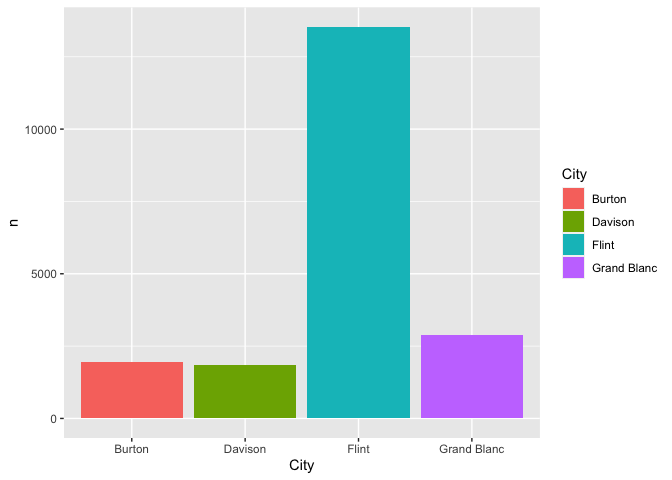<!-- -->

\#Phase 3 - Time

With Flint in Mind, we wanted to look at an additional variable that
originally didn’t stand out to us, time. By looking at time we could see
if there were specific patterns to when crashes were happening and if
that has any specific affect. In looking at this information two things
stood out. The hour and the Day that accidents were happening. A large
portion of accidents were happening during the hours in which
pedestrians would be going to or leaving from work. Additionally, a
large portion of accidents were occuring during weekdays in comparison
to weekends.

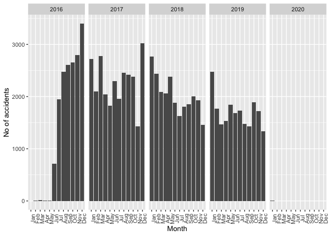<!-- -->

    ## Warning: Ignoring unknown parameters: binwidth, bins, pad

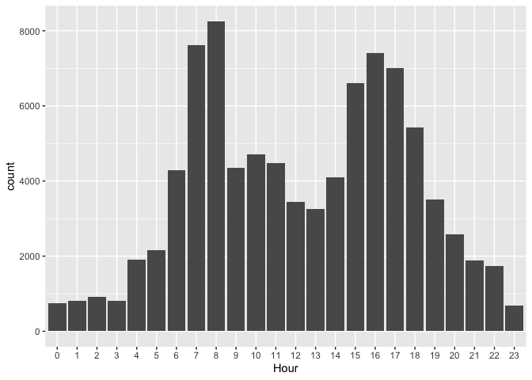<!-- -->

\#Phase 4 - Filter

Below you will see the most important part of identifying specific
locations. By filtering on city and grouping by street, we were able to
Identify the top locations by street that accidents were occuring at in
Flint. Moreover, we were able to create a dataset strictly based around
the top location (I-75.) From there we were able to count term frequency
on (I-75) street descriptions. This gave us the exact intersections in
which accidents occured most frequently. Below, we do this filtering and
also look into most variables using Flint speicifically as the location.

    ##          Street        n         
    ##  Buick Fwy N:1   Min.   : 242.0  
    ##  Corunna Rd :1   1st Qu.: 262.2  
    ##  I-69 E     :1   Median : 338.5  
    ##  I-69 W     :1   Mean   : 400.5  
    ##  I-75 N     :1   3rd Qu.: 421.0  
    ##  N Dort Hwy :1   Max.   :1009.0  
    ##  (Other)    :4

    ## [1] 1009   49

    ##     Severity      Distance.mi.    Temperature.F.   Wind_Chill.F.   
    ##  Min.   :2.000   Min.   :0.0000   Min.   :-15.00   Min.   :-30.90  
    ##  1st Qu.:3.000   1st Qu.:0.0000   1st Qu.: 28.90   1st Qu.:  9.30  
    ##  Median :3.000   Median :0.0000   Median : 46.00   Median : 22.60  
    ##  Mean   :2.852   Mean   :0.1662   Mean   : 47.38   Mean   : 24.12  
    ##  3rd Qu.:3.000   3rd Qu.:0.0100   3rd Qu.: 68.00   3rd Qu.: 35.20  
    ##  Max.   :4.000   Max.   :8.2300   Max.   : 95.00   Max.   : 91.00  
    ##                                   NA's   :5        NA's   :452     
    ##   Humidity...      Pressure.in.   Visibility.mi.   Wind_Speed.mph.
    ##  Min.   : 16.00   Min.   :28.55   Min.   : 0.200   Min.   : 0.00  
    ##  1st Qu.: 57.00   1st Qu.:29.82   1st Qu.: 9.000   1st Qu.: 6.90  
    ##  Median : 74.00   Median :30.01   Median :10.000   Median : 9.20  
    ##  Mean   : 70.85   Mean   :29.95   Mean   : 8.553   Mean   :10.19  
    ##  3rd Qu.: 86.00   3rd Qu.:30.18   3rd Qu.:10.000   3rd Qu.:12.70  
    ##  Max.   :100.00   Max.   :30.76   Max.   :10.000   Max.   :42.60  
    ##  NA's   :5        NA's   :2       NA's   :3        NA's   :64     
    ##  Precipitation.in.
    ##  Min.   :0.0000   
    ##  1st Qu.:0.0000   
    ##  Median :0.0000   
    ##  Mean   :0.0182   
    ##  3rd Qu.:0.0100   
    ##  Max.   :0.7400   
    ##  NA's   :654

\#\#\#Flint Specific weekdays and time Crash
    data

    ## Warning: Ignoring unknown parameters: binwidth, bins, pad

    ## Warning: Use of `Specificlocation$Start_Time` is discouraged. Use `Start_Time`
    ## instead.

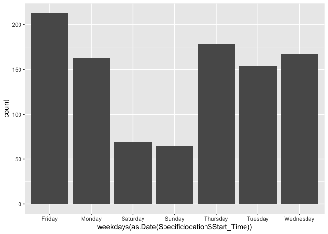<!-- -->

    ## Warning: Ignoring unknown parameters: binwidth, bins, pad

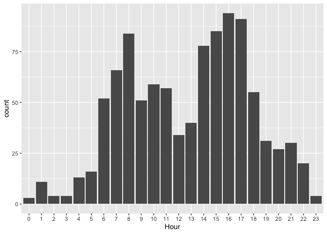<!-- -->

    ## [1] 388  49

    ## # A tibble: 1 x 14
    ## # Groups:   Amenity, Bump, Crossing, Give_Way, Junction, No_Exit, Railway,
    ## #   Roundabout, Station, Stop, Traffic_Calming, Traffic_Signal, Turning_Loop
    ## #   [1]
    ##   Amenity Bump  Crossing Give_Way Junction No_Exit Railway Roundabout Station
    ##   <fct>   <fct> <fct>    <fct>    <fct>    <fct>   <fct>   <fct>      <fct>  
    ## 1 False   False False    False    False    False   False   False      False  
    ## # … with 5 more variables: Stop <fct>, Traffic_Calming <fct>,
    ## #   Traffic_Signal <fct>, Turning_Loop <fct>, n <int>

    ##   Amenity       Bump      Crossing    Give_Way    Junction    No_Exit   
    ##  False:388   False:388   False:388   False:388   False:388   False:388  
    ##  True :  0   True :  0   True :  0   True :  0   True :  0   True :  0  
    ##   Railway    Roundabout   Station       Stop     Traffic_Calming Traffic_Signal
    ##  False:388   False:388   False:388   False:388   False:388       False:388     
    ##  True :  0   True :  0   True :  0   True :  0   True :  0       True :  0     
    ##  Turning_Loop
    ##  False:388   
    ## 

    ## # A tibble: 2 x 14
    ## # Groups:   Amenity, Bump, Crossing, Give_Way, Junction, No_Exit, Railway,
    ## #   Roundabout, Station, Stop, Traffic_Calming, Traffic_Signal, Turning_Loop
    ## #   [2]
    ##   Amenity Bump  Crossing Give_Way Junction No_Exit Railway Roundabout Station
    ##   <fct>   <fct> <fct>    <fct>    <fct>    <fct>   <fct>   <fct>      <fct>  
    ## 1 False   False False    False    False    False   False   False      False  
    ## 2 False   False False    False    True     False   False   False      False  
    ## # … with 5 more variables: Stop <fct>, Traffic_Calming <fct>,
    ## #   Traffic_Signal <fct>, Turning_Loop <fct>, n <int>

    ##   Amenity        Bump       Crossing     Give_Way     Junction    No_Exit    
    ##  False:1009   False:1009   False:1009   False:1009   False:965   False:1009  
    ##  True :   0   True :   0   True :   0   True :   0   True : 44   True :   0  
    ##   Railway     Roundabout    Station        Stop      Traffic_Calming
    ##  False:1009   False:1009   False:1009   False:1009   False:1009     
    ##  True :   0   True :   0   True :   0   True :   0   True :   0     
    ##  Traffic_Signal Turning_Loop
    ##  False:1009     False:1009  
    ##  True :   0

    ## # A tibble: 46,338 x 2
    ##    Description                                                  n
    ##    <fct>                                                    <int>
    ##  1 Accident on I-75 Northbound at Exit 118 M-21 Corunna Rd.   112
    ##  2 Accident on Hill Rd at Fenton Rd.                          106
    ##  3 At I-75/Exit 18 - Accident.                                 96
    ##  4 At 12 Mile Rd/Exit 63 - Accident.                           84
    ##  5 Accident on I-75 Southbound at Exit 118 M-21 Corunna Rd.    79
    ##  6 At Davison/I-96 Local/Exit 186 - Accident.                  77
    ##  7 Accident on I-75 Northbound at Exit 131 M-57 Vienna Rd.     76
    ##  8 Accident on Court St at Center Rd.                          75
    ##  9 Accident on US-23 Northbound at Exit 88 Grand Blanc Rd.     75
    ## 10 Accident on M-11 28th St at Eastern Ave.                    74
    ## # … with 46,328 more rows

\#Phase4 - Continued

We then went through this same process on Wayne Count and Kent County to
see if there was a large difference from Genesee. In our project writeup
we go indepth on what we found.

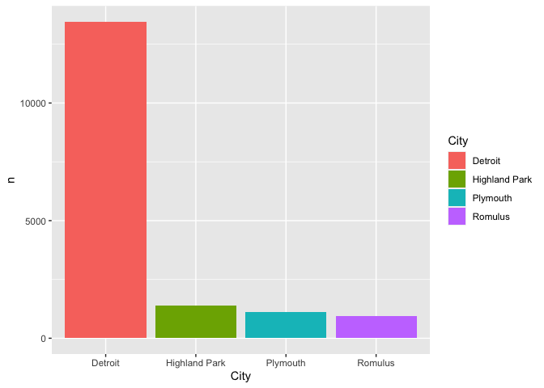<!-- -->

    ##                    Street        n         
    ##  Chrysler Expy S      :1   Min.   : 279.0  
    ##  Edsel Ford Fwy E     :1   1st Qu.: 362.0  
    ##  Edsel Ford Fwy W     :1   Median : 433.0  
    ##  Edward J Jeffries Fwy:1   Mean   : 657.7  
    ##  Fisher Fwy N         :1   3rd Qu.: 996.0  
    ##  Grand River Ave      :1   Max.   :1825.0  
    ##  (Other)              :7

    ## [1] 1009   49

    ##     Severity      Distance.mi.    Temperature.F.  Wind_Chill.F.   
    ##  Min.   :2.000   Min.   :0.0000   Min.   :-11.0   Min.   :-32.70  
    ##  1st Qu.:3.000   1st Qu.:0.0000   1st Qu.: 36.0   1st Qu.: 19.30  
    ##  Median :3.000   Median :0.0000   Median : 54.0   Median : 29.00  
    ##  Mean   :2.785   Mean   :0.1221   Mean   : 52.5   Mean   : 30.06  
    ##  3rd Qu.:3.000   3rd Qu.:0.0790   3rd Qu.: 70.0   3rd Qu.: 37.70  
    ##  Max.   :4.000   Max.   :5.0500   Max.   : 93.0   Max.   : 85.00  
    ##                                   NA's   :5       NA's   :1027    
    ##   Humidity...      Pressure.in.   Visibility.mi.   Wind_Speed.mph.
    ##  Min.   : 19.00   Min.   :28.41   Min.   : 0.200   Min.   : 0.00  
    ##  1st Qu.: 56.00   1st Qu.:29.83   1st Qu.:10.000   1st Qu.: 5.80  
    ##  Median : 69.00   Median :30.01   Median :10.000   Median : 9.00  
    ##  Mean   : 69.46   Mean   :29.96   Mean   : 8.895   Mean   : 9.36  
    ##  3rd Qu.: 86.00   3rd Qu.:30.15   3rd Qu.:10.000   3rd Qu.:11.50  
    ##  Max.   :100.00   Max.   :31.03   Max.   :10.000   Max.   :33.40  
    ##  NA's   :5        NA's   :6       NA's   :5        NA's   :119    
    ##  Precipitation.in.
    ##  Min.   :0.0000   
    ##  1st Qu.:0.0000   
    ##  Median :0.0000   
    ##  Mean   :0.0314   
    ##  3rd Qu.:0.0300   
    ##  Max.   :0.8400   
    ##  NA's   :1329

    ## # A tibble: 3 x 14
    ## # Groups:   Amenity, Bump, Crossing, Give_Way, Junction, No_Exit, Railway,
    ## #   Roundabout, Station, Stop, Traffic_Calming, Traffic_Signal, Turning_Loop
    ## #   [3]
    ##   Amenity Bump  Crossing Give_Way Junction No_Exit Railway Roundabout Station
    ##   <fct>   <fct> <fct>    <fct>    <fct>    <fct>   <fct>   <fct>      <fct>  
    ## 1 False   False False    False    False    False   False   False      False  
    ## 2 False   False False    False    False    False   False   False      False  
    ## 3 False   False False    False    True     False   False   False      False  
    ## # … with 5 more variables: Stop <fct>, Traffic_Calming <fct>,
    ## #   Traffic_Signal <fct>, Turning_Loop <fct>, n <int>

    ##   Amenity        Bump       Crossing     Give_Way     Junction     No_Exit    
    ##  False:1825   False:1825   False:1825   False:1825   False:1450   False:1825  
    ##  True :   0   True :   0   True :   0   True :   0   True : 375   True :   0  
    ##   Railway     Roundabout    Station        Stop      Traffic_Calming
    ##  False:1825   False:1825   False:1825   False:1825   False:1825     
    ##  True :   0   True :   0   True :   0   True :   0   True :   0     
    ##  Traffic_Signal Turning_Loop
    ##  False:1821     False:1825  
    ##  True :   4

Kent County

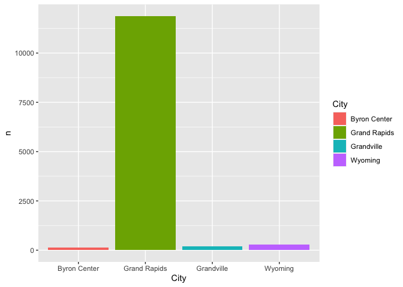<!-- -->

    ##                  Street        n        
    ##  28th St SE         :1   Min.   :245.0  
    ##  Burton St SE       :1   1st Qu.:328.5  
    ##  Division Ave S     :1   Median :360.0  
    ##  Gerald R Ford Fwy W:1   Mean   :411.9  
    ##  I-96 E             :1   3rd Qu.:494.2  
    ##  Leonard St NE      :1   Max.   :661.0  
    ##  (Other)            :2

    ## [1] 661  49

    ##     Severity      Distance.mi.    Temperature.F.  Wind_Chill.F.   
    ##  Min.   :2.000   Min.   :0.0000   Min.   :-9.90   Min.   :-28.40  
    ##  1st Qu.:2.000   1st Qu.:0.0000   1st Qu.:33.00   1st Qu.: 15.00  
    ##  Median :2.000   Median :0.0100   Median :48.90   Median : 27.20  
    ##  Mean   :2.186   Mean   :0.2345   Mean   :48.09   Mean   : 30.90  
    ##  3rd Qu.:2.000   3rd Qu.:0.3600   3rd Qu.:67.00   3rd Qu.: 41.77  
    ##  Max.   :4.000   Max.   :3.8600   Max.   :91.90   Max.   : 90.00  
    ##                                   NA's   :2       NA's   :263     
    ##   Humidity...      Pressure.in.   Visibility.mi.   Wind_Speed.mph.
    ##  Min.   : 17.00   Min.   :28.47   Min.   : 0.100   Min.   : 0.00  
    ##  1st Qu.: 62.00   1st Qu.:29.65   1st Qu.: 6.000   1st Qu.: 6.90  
    ##  Median : 78.00   Median :29.96   Median :10.000   Median : 9.20  
    ##  Mean   : 74.28   Mean   :29.85   Mean   : 7.733   Mean   :10.41  
    ##  3rd Qu.: 89.00   3rd Qu.:30.14   3rd Qu.:10.000   3rd Qu.:13.80  
    ##  Max.   :100.00   Max.   :30.79   Max.   :10.000   Max.   :35.70  
    ##  NA's   :2        NA's   :2       NA's   :2        NA's   :25     
    ##  Precipitation.in.
    ##  Min.   :0.0000   
    ##  1st Qu.:0.0000   
    ##  Median :0.0000   
    ##  Mean   :0.0196   
    ##  3rd Qu.:0.0100   
    ##  Max.   :0.4200   
    ##  NA's   :325

    ## # A tibble: 2 x 14
    ## # Groups:   Amenity, Bump, Crossing, Give_Way, Junction, No_Exit, Railway,
    ## #   Roundabout, Station, Stop, Traffic_Calming, Traffic_Signal, Turning_Loop
    ## #   [2]
    ##   Amenity Bump  Crossing Give_Way Junction No_Exit Railway Roundabout Station
    ##   <fct>   <fct> <fct>    <fct>    <fct>    <fct>   <fct>   <fct>      <fct>  
    ## 1 False   False False    False    False    False   False   False      False  
    ## 2 False   False False    False    True     False   False   False      False  
    ## # … with 5 more variables: Stop <fct>, Traffic_Calming <fct>,
    ## #   Traffic_Signal <fct>, Turning_Loop <fct>, n <int>

    ##   Amenity       Bump      Crossing    Give_Way    Junction    No_Exit   
    ##  False:661   False:661   False:661   False:661   False:573   False:661  
    ##  True :  0   True :  0   True :  0   True :  0   True : 88   True :  0  
    ##   Railway    Roundabout   Station       Stop     Traffic_Calming Traffic_Signal
    ##  False:661   False:661   False:661   False:661   False:661       False:661     
    ##  True :  0   True :  0   True :  0   True :  0   True :  0       True :  0     
    ##  Turning_Loop
    ##  False:661   
    ##
