Michigan Maps
================
Group 4
April 22, 2020

    ## Warning: Removed 5 rows containing missing values (position_stack).

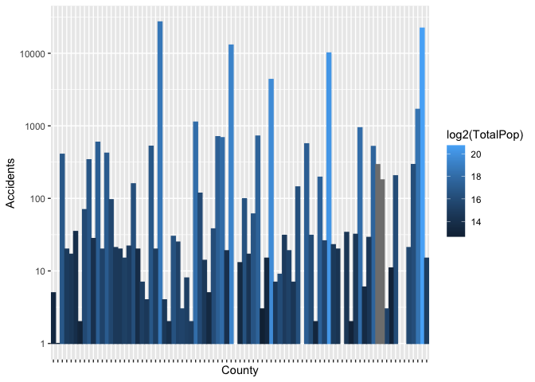<!-- -->

***Figure*** Total accidents from 2016 to 2019 in each county in
Michigan, higher populations typically result in more accidents.

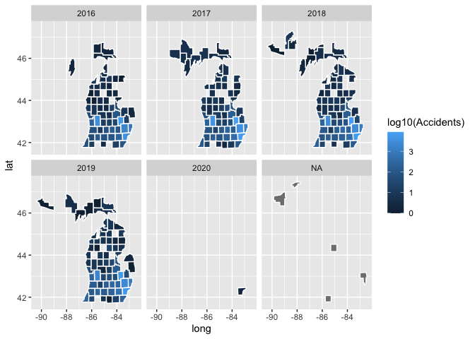<!-- -->

***Figure*** Total accidents (2016 - 2019) in each county of Michigan
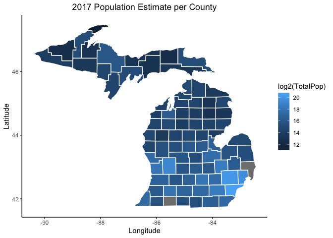<!-- -->

***Figure*** Total population of each county of Michigan (2017 Estimate)

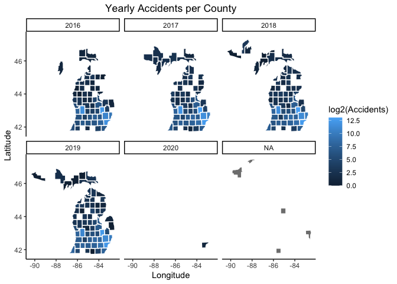<!-- -->

***Figure*** Yearly accidents in each Michigan County from 2016 - 2020.
2016 and 2020 are misssing data.

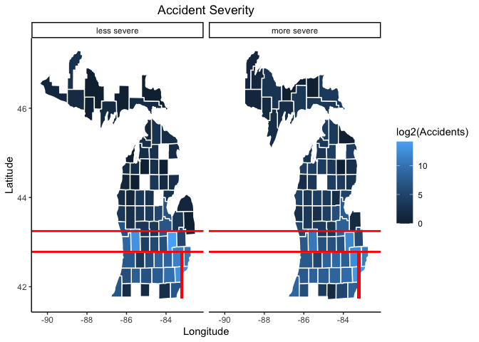<!-- -->

***Figure*** Decision tree splitting of Longitude and Latitude are shown
as red lines on the map.

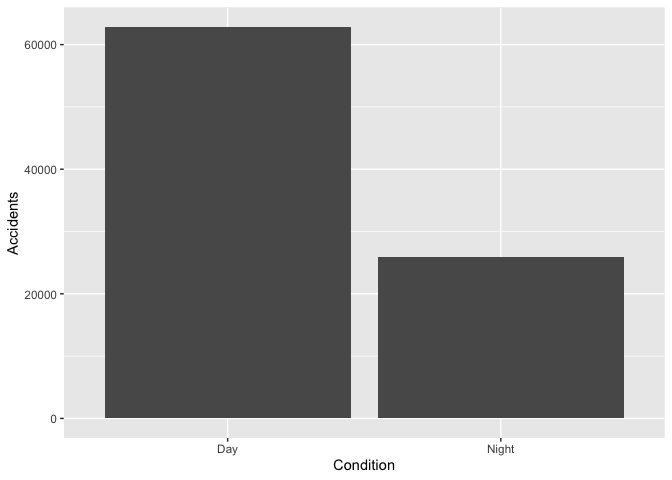<!-- -->

***Figure*** Plot of Accidents per Capita in Michigan counties.

    ## Warning: Removed 1 rows containing non-finite values (stat_bin).

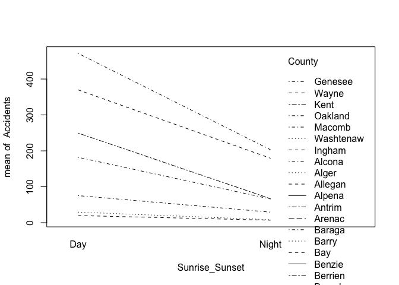<!-- -->

***Figure*** Effect of temperature on accidents in Michigan

<!-- -->

***Figure*** More accidents occur during the day.

    ## # A tibble: 80 x 2
    ##    County  Accidents
    ##    <fct>       <int>
    ##  1 Alcona          5
    ##  2 Alger           1
    ##  3 Allegan       406
    ##  4 Alpena         20
    ##  5 Antrim         17
    ##  6 Arenac         35
    ##  7 Baraga          2
    ##  8 Barry          70
    ##  9 Bay           341
    ## 10 Benzie         28
    ## # … with 70 more rows

    ## # A tibble: 80 x 2
    ##    County     Accidents
    ##    <fct>          <int>
    ##  1 Genesee        27072
    ##  2 Wayne          22214
    ##  3 Kent           12989
    ##  4 Oakland        10115
    ##  5 Macomb          4361
    ##  6 Washtenaw       1689
    ##  7 Ingham          1126
    ##  8 Ottawa           941
    ##  9 Livingston       723
    ## 10 Jackson          709
    ## # … with 70 more rows

***Table*** Total Accidents from 2016 - 2020 in each county.

    ## 
    ## Call:
    ## lm(formula = Accidents ~ Sunrise_Sunset + County, data = train_matct)
    ## 
    ## Residuals:
    ##      Min       1Q   Median       3Q      Max 
    ## -214.680  -48.827   -5.781   51.923  290.430 
    ## 
    ## Coefficients:
    ##                     Estimate Std. Error t value Pr(>|t|)    
    ## (Intercept)          397.570     12.584  31.593  < 2e-16 ***
    ## Sunrise_SunsetNight -120.890      8.947 -13.512  < 2e-16 ***
    ## CountyIngham        -326.123     16.815 -19.394  < 2e-16 ***
    ## CountyKent          -179.000     16.634 -10.761  < 2e-16 ***
    ## CountyMacomb        -284.833     16.634 -17.123  < 2e-16 ***
    ## CountyOakland       -213.125     16.634 -12.812  < 2e-16 ***
    ## CountyWashtenaw     -320.470     16.815 -19.058  < 2e-16 ***
    ## CountyWayne          -62.562     16.634  -3.761 0.000201 ***
    ## ---
    ## Signif. codes:  0 '***' 0.001 '**' 0.01 '*' 0.05 '.' 0.1 ' ' 1
    ## 
    ## Residual standard error: 81.49 on 324 degrees of freedom
    ## Multiple R-squared:  0.7276, Adjusted R-squared:  0.7218 
    ## F-statistic: 123.7 on 7 and 324 DF,  p-value: < 2.2e-16

    ## 
    ## Call:
    ## lm(formula = Accidents ~ Sunrise_Sunset + County + Month, data = train_matct)
    ## 
    ## Residuals:
    ##      Min       1Q   Median       3Q      Max 
    ## -206.679  -52.052   -6.275   50.798  267.871 
    ## 
    ## Coefficients:
    ##                     Estimate Std. Error t value Pr(>|t|)    
    ## (Intercept)          434.057     19.251  22.547  < 2e-16 ***
    ## Sunrise_SunsetNight -121.129      8.879 -13.643  < 2e-16 ***
    ## CountyIngham        -326.792     16.688 -19.583  < 2e-16 ***
    ## CountyKent          -179.000     16.502 -10.847  < 2e-16 ***
    ## CountyMacomb        -284.833     16.502 -17.260  < 2e-16 ***
    ## CountyOakland       -213.125     16.502 -12.915  < 2e-16 ***
    ## CountyWashtenaw     -320.638     16.688 -19.214  < 2e-16 ***
    ## CountyWayne          -62.562     16.502  -3.791  0.00018 ***
    ## Month02              -27.393     21.606  -1.268  0.20581    
    ## Month03              -13.929     21.606  -0.645  0.51963    
    ## Month04              -40.857     21.606  -1.891  0.05955 .  
    ## Month05              -41.214     22.028  -1.871  0.06227 .  
    ## Month06              -38.250     21.606  -1.770  0.07765 .  
    ## Month07              -62.069     21.810  -2.846  0.00472 ** 
    ## Month08              -38.989     21.810  -1.788  0.07480 .  
    ## Month09              -36.893     21.606  -1.707  0.08872 .  
    ## Month10              -32.893     21.606  -1.522  0.12893    
    ## Month11              -70.536     21.606  -3.265  0.00122 ** 
    ## Month12              -33.393     21.606  -1.546  0.12323    
    ## ---
    ## Signif. codes:  0 '***' 0.001 '**' 0.01 '*' 0.05 '.' 0.1 ' ' 1
    ## 
    ## Residual standard error: 80.84 on 313 degrees of freedom
    ## Multiple R-squared:  0.7411, Adjusted R-squared:  0.7262 
    ## F-statistic: 49.76 on 18 and 313 DF,  p-value: < 2.2e-16

    ## 
    ## Call:
    ## lm(formula = Accidents ~ Sunrise_Sunset + County + Month, data = train_matct)
    ## 
    ## Residuals:
    ##      Min       1Q   Median       3Q      Max 
    ## -206.679  -52.052   -6.275   50.798  267.871 
    ## 
    ## Coefficients:
    ##                     Estimate Std. Error t value Pr(>|t|)    
    ## (Intercept)          434.057     19.251  22.547  < 2e-16 ***
    ## Sunrise_SunsetNight -121.129      8.879 -13.643  < 2e-16 ***
    ## CountyIngham        -326.792     16.688 -19.583  < 2e-16 ***
    ## CountyKent          -179.000     16.502 -10.847  < 2e-16 ***
    ## CountyMacomb        -284.833     16.502 -17.260  < 2e-16 ***
    ## CountyOakland       -213.125     16.502 -12.915  < 2e-16 ***
    ## CountyWashtenaw     -320.638     16.688 -19.214  < 2e-16 ***
    ## CountyWayne          -62.562     16.502  -3.791  0.00018 ***
    ## Month02              -27.393     21.606  -1.268  0.20581    
    ## Month03              -13.929     21.606  -0.645  0.51963    
    ## Month04              -40.857     21.606  -1.891  0.05955 .  
    ## Month05              -41.214     22.028  -1.871  0.06227 .  
    ## Month06              -38.250     21.606  -1.770  0.07765 .  
    ## Month07              -62.069     21.810  -2.846  0.00472 ** 
    ## Month08              -38.989     21.810  -1.788  0.07480 .  
    ## Month09              -36.893     21.606  -1.707  0.08872 .  
    ## Month10              -32.893     21.606  -1.522  0.12893    
    ## Month11              -70.536     21.606  -3.265  0.00122 ** 
    ## Month12              -33.393     21.606  -1.546  0.12323    
    ## ---
    ## Signif. codes:  0 '***' 0.001 '**' 0.01 '*' 0.05 '.' 0.1 ' ' 1
    ## 
    ## Residual standard error: 80.84 on 313 degrees of freedom
    ## Multiple R-squared:  0.7411, Adjusted R-squared:  0.7262 
    ## F-statistic: 49.76 on 18 and 313 DF,  p-value: < 2.2e-16

***Figure*** Summary of linear regression models. The first linear
regression model with predicting accident volume by county and day vs
night, Test MSE is lower than second model and is used to generate the
figures below.

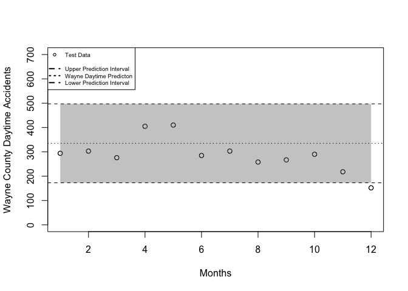<!-- -->

***Figure*** Using linear regression to predict the number of daytime
accidents in each month of the year in Wayne County.

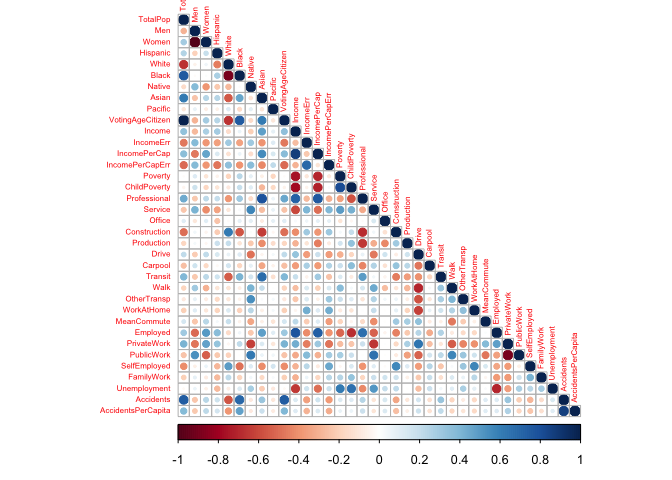<!-- -->

***Figure*** Using linear regression to predict the number of nighttime
accidents in each month of the year in Wayne County.

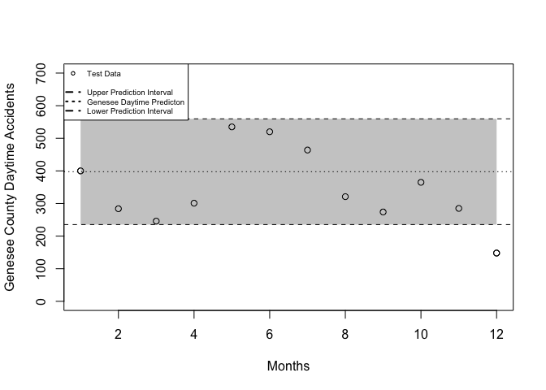<!-- -->

***Figure*** Using linear regression to predict the number of daytime
accidents in each month of the year in Genesee County.

<!-- -->

***Figure*** Using linear regression to predict the number of nighttime
accidents in each month of the year in Genesee County.

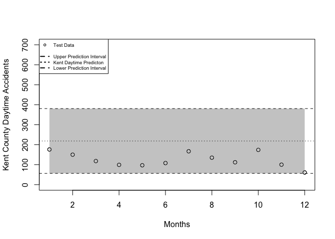<!-- -->

***Figure*** Using linear regression to predict the number of daytime
accidents in each month of the year in Kent County.

    ##        fit      lwr      upr
    ## 1 97.68016 72.92307 122.4373

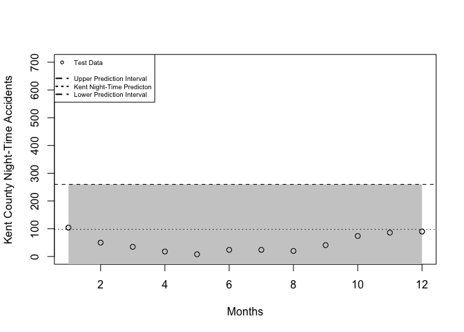<!-- -->

***Figure*** Using linear regression to predict the number of nighttime
accidents in each month of the year in Kent County.

<!-- -->

    ## Loading required package: carData

    ## 
    ## Attaching package: 'car'

    ## The following object is masked from 'package:purrr':
    ## 
    ##     some

    ## The following object is masked from 'package:dplyr':
    ## 
    ##     recode

    ## Anova Table (Type III tests)
    ## 
    ## Response: Accidents
    ##                 Sum Sq  Df F value    Pr(>F)    
    ## (Intercept)    6421246   1  966.94 < 2.2e-16 ***
    ## Sunrise_Sunset 1212353   1  182.56 < 2.2e-16 ***
    ## County         4596049   6  115.35 < 2.2e-16 ***
    ## Residuals      2151614 324                      
    ## ---
    ## Signif. codes:  0 '***' 0.001 '**' 0.01 '*' 0.05 '.' 0.1 ' ' 1

***Figure*** Anova analysis shows that more accidents occur during the
day.

<table>

<thead>

<tr>

<th style="text-align:left;">

City

</th>

<th style="text-align:right;">

Accidents

</th>

</tr>

</thead>

<tbody>

<tr>

<td style="text-align:left;">

Flint

</td>

<td style="text-align:right;">

13533

</td>

</tr>

<tr>

<td style="text-align:left;">

Detroit

</td>

<td style="text-align:right;">

13459

</td>

</tr>

<tr>

<td style="text-align:left;">

Grand Rapids

</td>

<td style="text-align:right;">

11913

</td>

</tr>

</tbody>

</table>

***Table*** Three cities (Flint, Detroit, and Grand Rapids) in Michigan
account for the majority of the accidents reported in the state from
2016-2019.

    ## Source : https://maps.googleapis.com/maps/api/staticmap?center=wayne%20county&zoom=10&size=640x640&scale=2&maptype=terrain&language=en-EN&key=xxx-ByU

    ## Source : https://maps.googleapis.com/maps/api/geocode/json?address=wayne+county&key=xxx-ByU

    ## Warning: Removed 1 rows containing missing values (geom_point).

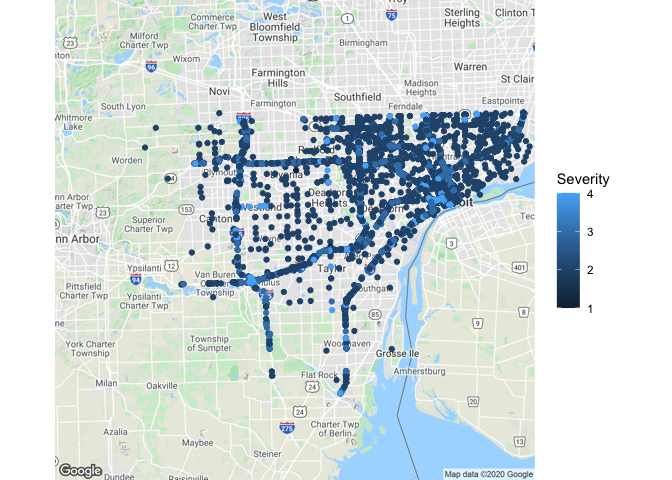<!-- -->

***Figure*** Accidents in Wayne County from 2016 -
    2019.

    ## Source : https://maps.googleapis.com/maps/api/staticmap?center=flint&zoom=12&size=640x640&scale=2&maptype=terrain&language=en-EN&key=xxx-ByU

    ## Source : https://maps.googleapis.com/maps/api/geocode/json?address=flint&key=xxx-ByU

    ## Warning: Removed 10855 rows containing missing values (geom_point).

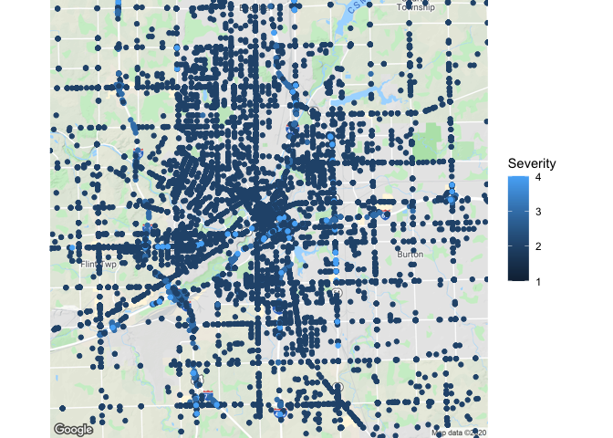<!-- -->

***Figure*** Accidents near
    Flint.

    ## Source : https://maps.googleapis.com/maps/api/staticmap?center=I-75,%20M118,%20Flint&zoom=14&size=640x640&scale=2&maptype=terrain&language=en-EN&key=xxx-ByU

    ## Source : https://maps.googleapis.com/maps/api/geocode/json?address=I-75,+M118,+Flint&key=xxx-ByU

    ## Warning: Removed 24498 rows containing missing values (geom_point).

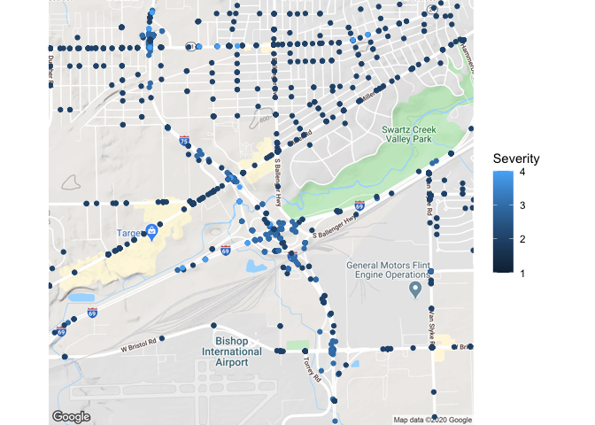<!-- -->

***Figure*** Accidents near I-75 Exit
    118.

    ## Source : https://maps.googleapis.com/maps/api/staticmap?center=grand%20rapids&zoom=12&size=640x640&scale=2&maptype=terrain&language=en-EN&key=xxx-ByU

    ## Source : https://maps.googleapis.com/maps/api/geocode/json?address=grand+rapids&key=xxx-ByU

    ## Warning: Removed 1089 rows containing missing values (geom_point).

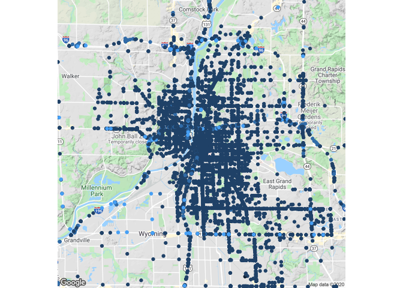<!-- -->

***Figure*** Accidents near Grand Rapids.

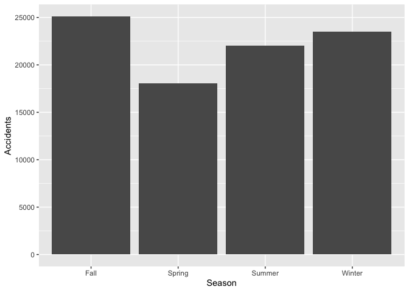<!-- -->

***Figure*** Total number of accidents in the dataset for each season.

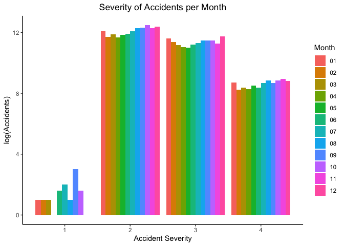<!-- -->

***Figure*** Count of severity at each level (1-4) for each month.
Severity does not differ significantly month to month.

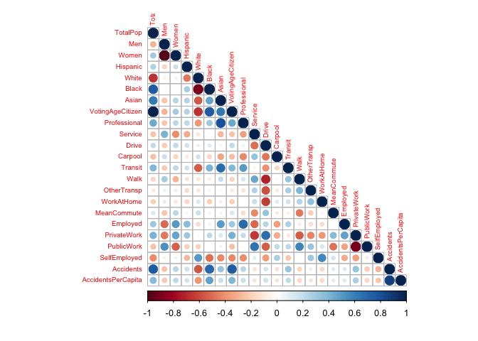<!-- -->

***Figure*** Correlation Plot of Accidents and Accident per capita
vs. all other census variables.

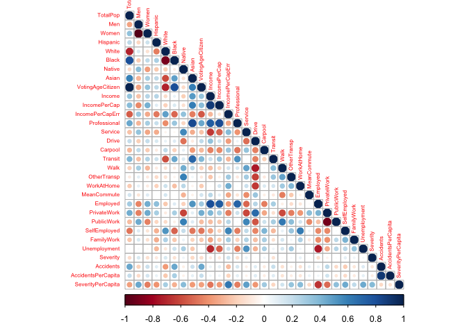<!-- -->

***Figure*** Included Severity Per Captita which positively correlates
to the Income Per Capita census
    variable.

    ## Source : https://maps.googleapis.com/maps/api/staticmap?center=michigan&zoom=6&size=640x640&scale=2&maptype=terrain&language=en-EN&key=xxx-ByU

    ## Source : https://maps.googleapis.com/maps/api/geocode/json?address=michigan&key=xxx-ByU

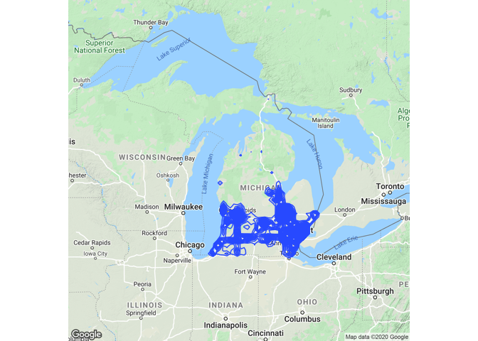<!-- -->

***Figure*** Density plot of accidents in Michigan.
